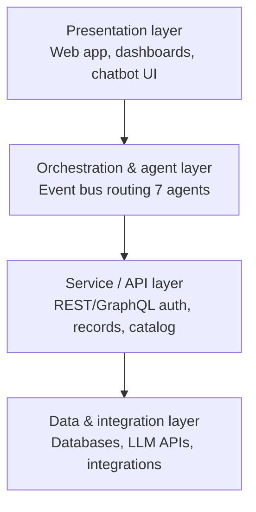
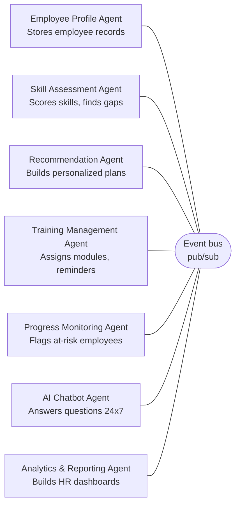

# Product Requirements Document (PRD)

## Multi-Agent System for Smart Employee Training and Onboarding Management

**Version:** 1.0
**Status:** Draft
**Owner:** HR Technology / Product Team

---

## 1. Overview

### 1.1 Purpose
This PRD defines the product requirements for a Multi-Agent AI System that automates and personalizes employee onboarding and continuous training. It replaces manual, one-size-fits-all onboarding with an adaptive process driven by seven specialized, collaborating AI agents.

### 1.2 Background
Traditional onboarding is manual, slow, and generic across roles and skill levels, resulting in low engagement, poor progress visibility, high HR workload, and delayed employee productivity. Multi-Agent Systems (MAS) allow specialized autonomous agents to divide this work, communicate asynchronously, and continuously adapt to each employee.

### 1.3 Goals
- Automate the end-to-end onboarding lifecycle.
- Personalize learning paths based on skill assessment and job role.
- Provide real-time employee support via an AI chatbot.
- Give HR continuous visibility into progress and training effectiveness.
- Reduce HR administrative workload and time-to-productivity for new hires.

### 1.4 Non-Goals
- This PRD does not cover payroll, benefits administration, or full HRMS/ERP replacement (these are future integrations, not core scope).
- Native mobile apps are out of scope for v1 (listed under Future Scope).

---

## 2. Target Users

| User type | Needs |
|---|---|
| New employee | Fast, personalized onboarding; clear learning path; instant answers to questions |
| Existing employee (continuous training) | Relevant upskilling recommendations; progress tracking |
| HR / L&D admin | Automated workflows, less manual tracking, visibility into org-wide training health |
| Manager | Visibility into direct reports' onboarding/training progress |
| System admin | User/role management, module configuration, integration setup |

---

## 3. Success Metrics

- Reduction in average onboarding completion time (target: measurable % decrease vs. baseline manual process).
- Increase in training module completion rate.
- Reduction in HR hours spent per onboarded employee.
- Chatbot deflection rate (% of employee queries resolved without human HR intervention).
- Employee satisfaction / engagement score for onboarding experience.

---

## 4. Functional Requirements

### 4.1 Core Modules
- User Authentication (JWT/OAuth)
- Employee Registration
- Profile Management
- Skill Assessment
- Personalized Learning Recommendation
- Training Assignment & Course Management
- Progress Tracking
- AI Chatbot
- Performance Evaluation
- Analytics Dashboard & Report Generation
- Notification System
- Admin Panel

### 4.2 Agent-Level Requirements

| Agent | Responsibilities | Key Inputs | Key Outputs |
|---|---|---|---|
| Employee Profile Agent | Collects and stores employee info (education, department, role) | HR registration form data | Employee profile record |
| Skill Assessment Agent | Runs initial assessments, identifies strengths/weaknesses, calculates skill gaps | Employee profile, assessment responses | Skill score, gap report |
| Learning Recommendation Agent | Recommends personalized training using AI; updates recommendations continuously | Skill gap report, job role | Personalized learning plan |
| Training Management Agent | Assigns modules, schedules sessions, sends reminders | Learning plan | Course assignments, notifications |
| Progress Monitoring Agent | Tracks completion, evaluates performance, flags at-risk employees | Course activity, scores | Progress status, alerts |
| AI Chatbot Agent | Answers employee questions 24x7, guides onboarding steps | Employee query, context | Real-time response |
| Analytics & Reporting Agent | Aggregates data into HR dashboards and effectiveness reports | Data from all agents | Reports, dashboards |

---

## 5. Extended System Architecture

### 5.1 Architectural Style
The system uses a **layered, event-driven, multi-agent architecture**. It avoids a single monolithic backend in favor of loosely-coupled, independently deployable agents that communicate through an event bus rather than direct calls. This enables independent scaling, fault isolation, and easy extension with new agents in the future.

### 5.2 Layered View

**Layer 1 — Presentation Layer**
React.js/Angular web app (and future mobile app) for HR/Admin and employees. Provides login, dashboards, chatbot UI, and course consumption screens.

**Layer 2 — Orchestration & Agent Layer**
The core of the system. A central **Orchestrator / Event Bus** (implemented via a message broker or an agent framework such as CrewAI/AutoGen) routes events between the seven specialized agents. Agents are decoupled — none call each other directly.

**Layer 3 — Service / API Layer**
Backend REST/GraphQL services (Node.js/Django/Spring Boot) for authentication, employee records, course catalog, and reporting. Agents read/write persistent data through these services rather than touching the database directly, keeping data access centralized and auditable.

**Layer 4 — Data & Integration Layer**
Relational/NoSQL databases (MySQL/PostgreSQL/MongoDB), the LLM gateway (OpenRouter, routing to OpenAI/Gemini/Anthropic and other providers) powering the Recommendation and Chatbot agents, and future third-party integrations (HRMS, ERP, calendar/notification systems).

**Layer diagram:**

### 5.3 Agent Communication Protocol

Agents communicate asynchronously via a **publish-subscribe event model**. This is the backbone of the multi-agent design and should be treated as a first-class part of the architecture, not an implementation detail.

**Design principles:**
- Agents never call each other's APIs directly; they only publish events to, and consume events from, the bus.
- Every event has a defined schema (versioned) so agents can evolve independently.
- Events are idempotent-safe — an agent re-processing the same event must not duplicate side effects (e.g., re-sending a duplicate notification).
- Failed event processing is retried with backoff and routed to a dead-letter queue after N attempts, so one agent's failure does not block the pipeline.

**Agent / event bus diagram:**

*Agents never call each other directly — each one only publishes to and consumes from the bus.*

**Primary event flow:**

| Step | Event name | Published by | Consumed by | Payload (example fields) |
|---|---|---|---|---|
| 1 | `employee.registered` | Profile Agent | Skill Assessment Agent | employee_id, name, department, role, joining_date |
| 2 | `assessment.completed` | Skill Assessment Agent | Recommendation Agent | employee_id, skill_score, weak_areas |
| 3 | `plan.created` | Recommendation Agent | Training Management Agent | employee_id, recommended_modules[] |
| 4 | `training.assigned` | Training Management Agent | Progress Monitoring Agent, Notification System | employee_id, module_id, due_date |
| 5 | `progress.updated` | Progress Monitoring Agent | Analytics Agent, Training Management Agent (for re-scheduling) | employee_id, module_id, completion_status, score |
| 6 | `support.query_raised` | Chatbot Agent (triggered by employee) | Analytics Agent (for logging) | employee_id, query_text, resolved (bool) |
| 7 | `report.generated` | Analytics Agent | HR Dashboard (Presentation Layer) | report_id, employee_id or org-level scope, metrics |

**Underlying transport options:**
- Lightweight/dev: in-process event emitter or Redis pub/sub.
- Production-scale: Kafka or RabbitMQ, enabling replay, durability, and multiple consumer groups per event type.

### 5.4 Data Flow Summary

1. HR registers a new employee → Profile Agent creates the profile.
2. Skill Assessment Agent evaluates the employee and computes gaps.
3. Recommendation Agent generates a personalized plan using AI/LLM reasoning over the gap report and role.
4. Training Agent assigns and schedules modules, triggering notifications.
5. Progress Agent continuously tracks completion and performance, flagging employees who need support.
6. Chatbot Agent handles employee queries at any point in the journey, logging interactions.
7. Analytics Agent aggregates all agent outputs into HR dashboards and reports.

### 5.5 Deployment View

For a production-grade deployment:
- Each agent is packaged as an independent containerized service (Docker).
- Container orchestration (Kubernetes) allows independent horizontal scaling — e.g., scaling the Chatbot Agent during peak onboarding periods without scaling Analytics.
- The event bus (Kafka/RabbitMQ) is deployed as a managed cluster to guarantee durability and ordering per employee_id partition key.
- Databases are deployed with read replicas for the Analytics Agent's heavy read workloads, separate from the transactional write path used by Profile/Training agents.
- Secrets (LLM API keys, DB credentials) are managed via a secrets manager, not embedded in agent configs.

### 5.6 Non-Functional Requirements

| Category | Requirement |
|---|---|
| Scalability | Each agent must scale independently based on load |
| Availability | Chatbot Agent target uptime 99.9% (24x7 support requirement) |
| Latency | Chatbot response time < 3s for standard queries |
| Security | JWT/OAuth-based auth; role-based access control (employee/HR/admin) |
| Data privacy | Employee PII encrypted at rest and in transit |
| Auditability | All agent actions and events logged with timestamps for traceability |
| Extensibility | New agents can be added by subscribing to existing events without modifying existing agents |

---

## 6. Technology Stack

| Layer | Technology |
|---|---|
| Frontend | React.js / Angular |
| Backend | Node.js / Django / Spring Boot |
| Database | MySQL / PostgreSQL / MongoDB |
| AI Framework | Python, LangChain, CrewAI, AutoGen |
| Machine Learning | Scikit-learn, TensorFlow |
| Chatbot / LLM | OpenRouter (model-agnostic LLM gateway) — free `:free` models for dev/staging, paid models (OpenAI, Gemini, Anthropic, etc.) for production |
| Authentication | JWT / OAuth |
| Messaging / Event Bus | Kafka / RabbitMQ (production), Redis pub/sub (lightweight) |
| Deployment | Docker, Kubernetes |

---

## 7. Database Schema

### 7.1 Entities and Fields

**Users** (authentication/login, separate from the employee profile so HR/admin accounts can exist without a full employee record)
- user_id (PK)
- email (unique)
- password_hash
- role (employee / hr_admin / manager / system_admin)
- employee_id (FK → Employee.employee_id, nullable for pure admin accounts)
- created_at

**Department**
- department_id (PK)
- name
- manager_employee_id (FK → Employee.employee_id)

**Employee**
- employee_id (PK)
- name
- email (unique)
- department_id (FK → Department.department_id)
- role (job role/title)
- joining_date

**Skill_Assessment**
- assessment_id (PK)
- employee_id (FK → Employee.employee_id)
- skill_score
- weak_areas
- recommendation
- assessed_at

**Training_Module**
- module_id (PK)
- title
- difficulty
- duration
- category

**Training_Progress**
- progress_id (PK)
- employee_id (FK → Employee.employee_id)
- module_id (FK → Training_Module.module_id)
- completion_status (not_started / in_progress / completed)
- score
- updated_at

**Report**
- report_id (PK)
- employee_id (FK → Employee.employee_id, nullable for org-level reports)
- performance_score
- completion_percentage
- feedback
- generated_at

**Notification**
- notification_id (PK)
- employee_id (FK → Employee.employee_id)
- message
- type (reminder / alert / system)
- sent_at
- read_status

**Chat_Log**
- chat_id (PK)
- employee_id (FK → Employee.employee_id)
- query_text
- response_text
- resolved (bool)
- created_at

### 7.2 Relationships

- One **Department** has many **Employees** (1:N); an Employee belongs to exactly one Department.
- One **Employee** has many **Skill_Assessment** records (1:N) — assessments can be repeated over time (initial + periodic reassessments).
- One **Employee** has many **Training_Progress** records (1:N), and one **Training_Module** is referenced by many **Training_Progress** records (1:N) — Training_Progress is the associative entity resolving the many-to-many relationship between Employee and Training_Module.
- One **Employee** has many **Report** records (1:N); Reports may also be generated at an org/department level (employee_id nullable).
- One **Employee** has many **Notification** records (1:N).
- One **Employee** has many **Chat_Log** entries (1:N), capturing the full history of chatbot interactions.
- One **Employee** optionally has one **Users** login record (1:1) — admin-only accounts have no linked employee_id.
- One **Employee** may be the manager of one **Department** (1:1 optional, via Department.manager_employee_id).

### 7.3 Design Notes

- **Training_Progress** is intentionally its own table (not a field on Employee or Training_Module) because it resolves the many-to-many relationship: an employee takes many modules, and a module is taken by many employees.
- **Skill_Assessment** is kept as a history table rather than fields on Employee, so skill growth can be tracked over multiple assessment cycles rather than only the latest snapshot.
- Soft-delete/audit fields (created_at, updated_at) should be added consistently across tables for traceability, aligning with the auditability requirement in Section 5.6.

---

## 8. Methodology

The project follows an **Agile** development approach, iterating through: Employee Registration → Profile Creation → Skill Assessment → AI Analysis → Personalized Recommendation → Training Assignment → Employee Learning → Continuous Monitoring → Chatbot Assistance → Performance Evaluation → Report Generation.

---

## 9. Risks & Open Questions

- **LLM cost/latency**: Recommendation and Chatbot agents depend on external LLM APIs — need cost controls and fallback behavior if the API is unavailable.
- **OpenRouter free-tier reliability**: The `:free` model tier on OpenRouter is rate-limited (20 requests/minute, and a daily cap of 50 or 1,000 requests depending on lifetime credit purchases) and models can be deprioritized or rotated out without notice. This makes it unsuitable for the Chatbot Agent's 99.9% uptime / <3s latency targets (Section 5.6) in production. Recommendation: use free `:free` models for dev/staging only; use paid models (routed through the same OpenRouter integration) in production, with a fallback model configured in code for 429/5xx responses.
- **Data consistency**: With an event-driven model, eventual consistency between agents must be handled gracefully in the UI (e.g., "processing" states).
- **Event schema versioning**: Need a governance process for evolving event payloads without breaking downstream agents.
- **Cold-start assessments**: How are skill assessments calibrated for roles with no historical data?

---

## 10. Future Scope

Voice-enabled AI assistant, emotion/sentiment analysis, AR/VR onboarding, gamification, predictive performance analysis, HRMS/ERP integration, blockchain-based certification, multilingual support, mobile application, generative AI for dynamic training content.
