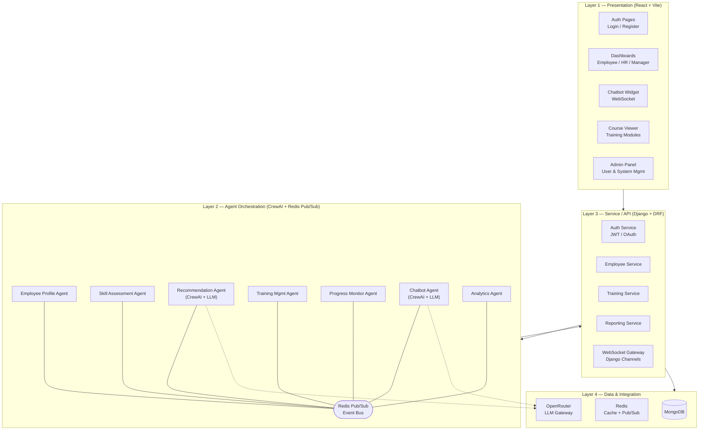
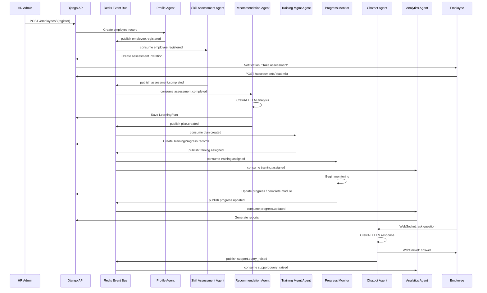

# Multi-Agent System for Smart Employee Training & Onboarding

## Implementation Plan

> [!NOTE]
> **Technology Stack Chosen:**
> Frontend: React.js + Vite · Backend: Django (Python) · Database: MongoDB · Event Bus: Redis Pub/Sub · AI Framework: CrewAI · LLM Gateway: OpenRouter

---

## 1. Background & Goal

Build a multi-agent AI system that automates and personalizes employee onboarding and continuous training. Seven specialized AI agents collaborate through an event-driven architecture (Redis pub/sub) to replace manual, one-size-fits-all onboarding with an adaptive, intelligent process. The system serves new employees, existing employees, HR admins, managers, and system admins.

---

## 2. User Review Required

> [!IMPORTANT]
> **MongoDB with Django:** Django's ORM (models, migrations) is designed for relational databases. With MongoDB, we'll use **`djongo`** or **`mongoengine`** as the ODM. This means we lose Django's built-in migration system and some admin panel features. Alternatively, we could use **Django REST Framework** purely as an API layer and manage MongoDB directly via **`motor`** (async) or **`pymongo`**. **Recommendation: Use `mongoengine` for document models + DRF for API serialization.** Please confirm.

> [!IMPORTANT]
> **CrewAI Agents as Background Workers:** CrewAI agents are Python processes. In this architecture, each agent will run as a Django management command or Celery worker that subscribes to Redis channels. CrewAI will orchestrate multi-step reasoning (e.g., the Recommendation Agent analyzing skill gaps and generating plans). Simple agents (Profile, Training Management) will be lightweight Django services without CrewAI overhead.

> [!WARNING]
> **OpenRouter Free Tier Limits:** As noted in the PRD (Section 9), free `:free` models have strict rate limits (20 req/min, 50–1000 daily). The plan uses free models for dev/staging only. Production will require paid API keys. The implementation includes fallback model configuration and 429/5xx retry logic.

---

## 3. Open Questions

1. **Assessment Content:** Do you have existing skill assessment questions/quizzes, or should the system generate them via LLM based on job role?
2. **Training Content:** Is there an existing course catalog/LMS to integrate, or will training modules be seeded manually and eventually generated?
3. **Email/Notification Provider:** Which email service for notifications? (SendGrid, AWS SES, or SMTP for dev?)
4. **Deployment Target:** Docker Compose for local/dev. What's the production target — self-hosted K8s, AWS ECS, GCP Cloud Run?
5. **User Volume Estimate:** Approximate number of concurrent employees/HR users for initial capacity planning?

---

## 4. High-Level Architecture



---

## 5. Project Structure

```
multi_agent_system_for_employee_tranining/
├── PRD.md
│
├── backend/                         # Django project root
│   ├── manage.py
│   ├── requirements.txt
│   ├── config/                      # Django project settings
│   │   ├── __init__.py
│   │   ├── settings/
│   │   │   ├── __init__.py
│   │   │   ├── base.py              # Common settings
│   │   │   ├── development.py       # Dev overrides
│   │   │   └── production.py        # Prod overrides
│   │   ├── urls.py
│   │   ├── asgi.py                  # ASGI for WebSocket support
│   │   └── wsgi.py
│   │
│   ├── apps/
│   │   ├── authentication/          # Auth app (JWT, RBAC)
│   │   │   ├── models.py            # User model (mongoengine)
│   │   │   ├── serializers.py
│   │   │   ├── views.py
│   │   │   ├── urls.py
│   │   │   ├── permissions.py       # RBAC permission classes
│   │   │   ├── middleware.py         # Security headers, CSRF
│   │   │   └── utils.py             # JWT secret resolution (secure)
│   │   │
│   │   ├── employees/               # Employee Profile Agent's data layer
│   │   │   ├── models.py            # Employee, Department documents
│   │   │   ├── serializers.py
│   │   │   ├── views.py
│   │   │   ├── urls.py
│   │   │   └── signals.py           # Publish employee.registered event
│   │   │
│   │   ├── assessments/             # Skill Assessment Agent's data layer
│   │   │   ├── models.py            # SkillAssessment document
│   │   │   ├── serializers.py
│   │   │   ├── views.py
│   │   │   ├── urls.py
│   │   │   └── tasks.py             # Agent logic: run assessment
│   │   │
│   │   ├── training/                # Training Management Agent's data layer
│   │   │   ├── models.py            # TrainingModule, TrainingProgress
│   │   │   ├── serializers.py
│   │   │   ├── views.py
│   │   │   ├── urls.py
│   │   │   └── tasks.py             # Agent logic: assign modules
│   │   │
│   │   ├── recommendations/         # Learning Recommendation Agent
│   │   │   ├── models.py            # LearningPlan document
│   │   │   ├── serializers.py
│   │   │   ├── views.py
│   │   │   ├── urls.py
│   │   │   ├── crew.py              # CrewAI crew definition
│   │   │   └── tasks.py             # CrewAI tasks + LLM calls
│   │   │
│   │   ├── progress/                # Progress Monitoring Agent
│   │   │   ├── models.py
│   │   │   ├── serializers.py
│   │   │   ├── views.py
│   │   │   ├── urls.py
│   │   │   └── tasks.py             # Monitor, flag at-risk employees
│   │   │
│   │   ├── chatbot/                 # AI Chatbot Agent
│   │   │   ├── models.py            # ChatLog document
│   │   │   ├── consumers.py         # Django Channels WebSocket consumer
│   │   │   ├── routing.py           # WebSocket URL routing
│   │   │   ├── crew.py              # CrewAI crew for chat reasoning
│   │   │   └── tasks.py
│   │   │
│   │   ├── analytics/               # Analytics & Reporting Agent
│   │   │   ├── models.py            # Report document
│   │   │   ├── serializers.py
│   │   │   ├── views.py
│   │   │   ├── urls.py
│   │   │   └── tasks.py             # Aggregate data, generate reports
│   │   │
│   │   └── notifications/           # Notification System
│   │       ├── models.py            # Notification document
│   │       ├── serializers.py
│   │       ├── views.py
│   │       ├── urls.py
│   │       └── tasks.py             # Send email/in-app notifications
│   │
│   ├── agents/                      # Agent orchestration layer
│   │   ├── __init__.py
│   │   ├── event_bus.py             # Redis pub/sub wrapper
│   │   ├── event_schemas.py         # Versioned event payload schemas
│   │   ├── agent_registry.py        # Agent subscription registry
│   │   └── management/
│   │       └── commands/
│   │           └── run_agents.py    # Management command to start agents
│   │
│   └── common/                      # Shared utilities
│       ├── __init__.py
│       ├── llm_client.py            # OpenRouter client with retry/fallback
│       ├── validators.py            # Input validation utilities
│       ├── exceptions.py            # Custom exception handlers
│       └── security.py              # Security helpers (secret resolution)
│
├── frontend/                        # React + Vite project
│   ├── package.json
│   ├── vite.config.js
│   ├── index.html
│   ├── public/
│   ├── src/
│   │   ├── main.jsx
│   │   ├── App.jsx
│   │   ├── index.css                # Global design system
│   │   │
│   │   ├── api/                     # API client layer
│   │   │   ├── client.js            # Axios/fetch wrapper (HTTPS, CSRF)
│   │   │   ├── auth.js
│   │   │   ├── employees.js
│   │   │   ├── assessments.js
│   │   │   ├── training.js
│   │   │   ├── chatbot.js           # WebSocket client
│   │   │   └── analytics.js
│   │   │
│   │   ├── components/              # Reusable UI components
│   │   │   ├── layout/
│   │   │   │   ├── Sidebar.jsx
│   │   │   │   ├── Header.jsx
│   │   │   │   └── MainLayout.jsx
│   │   │   ├── common/
│   │   │   │   ├── Button.jsx
│   │   │   │   ├── Card.jsx
│   │   │   │   ├── Modal.jsx
│   │   │   │   ├── LoadingSpinner.jsx
│   │   │   │   ├── DataTable.jsx
│   │   │   │   └── Chart.jsx
│   │   │   └── chatbot/
│   │   │       ├── ChatWidget.jsx
│   │   │       ├── ChatBubble.jsx
│   │   │       └── ChatInput.jsx
│   │   │
│   │   ├── pages/                   # Route-level pages
│   │   │   ├── auth/
│   │   │   │   ├── LoginPage.jsx
│   │   │   │   └── RegisterPage.jsx
│   │   │   ├── employee/
│   │   │   │   ├── DashboardPage.jsx
│   │   │   │   ├── ProfilePage.jsx
│   │   │   │   ├── AssessmentPage.jsx
│   │   │   │   ├── LearningPathPage.jsx
│   │   │   │   └── CoursePage.jsx
│   │   │   ├── hr/
│   │   │   │   ├── HRDashboardPage.jsx
│   │   │   │   ├── EmployeeListPage.jsx
│   │   │   │   ├── OnboardingPipeline.jsx
│   │   │   │   └── ReportsPage.jsx
│   │   │   ├── manager/
│   │   │   │   └── TeamProgressPage.jsx
│   │   │   └── admin/
│   │   │       ├── AdminDashboard.jsx
│   │   │       ├── UserManagement.jsx
│   │   │       └── SystemConfig.jsx
│   │   │
│   │   ├── hooks/                   # Custom React hooks
│   │   │   ├── useAuth.js
│   │   │   ├── useWebSocket.js
│   │   │   └── useApi.js
│   │   │
│   │   ├── context/                 # React context providers
│   │   │   ├── AuthContext.jsx
│   │   │   └── ThemeContext.jsx
│   │   │
│   │   └── utils/                   # Frontend utilities
│   │       ├── constants.js
│   │       ├── formatters.js
│   │       └── validators.js
│   │
│   └── .env.example
│
├── docker-compose.yml               # MongoDB + Redis + Django + Vite
├── Dockerfile.backend
├── Dockerfile.frontend
├── .env.example
└── README.md
```

---

## 6. Proposed Changes — Phased Implementation

### Phase 1: Foundation & Infrastructure

**Goal:** Set up project scaffolding, database connection, Redis event bus, security middleware, and the CI/build pipeline. Everything else builds on this.

---

#### [NEW] `docker-compose.yml`
- MongoDB 7.x container (listening on `127.0.0.1:27017`)
- Redis 7.x container (listening on `127.0.0.1:6379`)
- Django backend service
- Vite frontend dev server
- Environment variable configuration via `.env`

#### [NEW] `.env.example`
- `MONGODB_URI`, `REDIS_URL`, `OPENROUTER_API_KEY`, `JWT_SECRET_KEY` (with instructions — never hardcoded defaults)
- `DJANGO_SECRET_KEY`, `DEBUG`, `ALLOWED_HOSTS`
- `CORS_ALLOWED_ORIGINS`

---

#### [NEW] `backend/config/settings/base.py`
- Django settings using `mongoengine` for MongoDB connection
- Django REST Framework configuration
- Django Channels with Redis channel layer (for WebSocket)
- Security settings: CSRF, CORS (strict origin list), security headers
- Session settings with expiry (no infinite sessions)
- Logging configuration (no PII/secrets in logs)

#### [NEW] `backend/config/settings/development.py`
- `DEBUG = True`, localhost-only CORS
- Ephemeral JWT secret with logged warning (per secure coding guidelines)

#### [NEW] `backend/config/settings/production.py`
- `DEBUG = False`, strict CSP, HSTS
- JWT secret from environment only (error if missing)
- `SECURE_SSL_REDIRECT = True`

#### [NEW] `backend/config/urls.py`
- API URL routing: `/api/v1/auth/`, `/api/v1/employees/`, `/api/v1/assessments/`, etc.
- WebSocket routing for chatbot

#### [NEW] `backend/config/asgi.py`
- ASGI application with Django Channels for HTTP + WebSocket protocol routing

---

#### [NEW] `backend/common/security.py`
- `get_secret(name)` — multi-tiered secret resolution: env → file → random gen + severe warning
- Never returns hardcoded fallback strings

#### [NEW] `backend/common/llm_client.py`
- `OpenRouterClient` class wrapping API calls to OpenRouter
- Configurable model selection (`:free` suffix for dev, paid for prod)
- Retry logic with exponential backoff for 429/5xx responses
- Fallback model configuration
- Rate limiting awareness
- No API keys in code — loaded from env via `get_secret()`

#### [NEW] `backend/common/validators.py`
- Input validation utilities (allow-list based validation for types, lengths, formats)
- Email, name, department validators
- Assessment answer validators

#### [NEW] `backend/common/exceptions.py`
- Custom DRF exception handler — generic messages to user, detailed info in server logs only
- Never expose stack traces or database errors to client

---

#### [NEW] `backend/agents/event_bus.py`
- `EventBus` class wrapping Redis pub/sub
- `publish(channel, event)` — publishes versioned event with idempotency key
- `subscribe(channel, handler)` — subscribes with retry + dead-letter queue logic
- Event deduplication (idempotent processing via seen-event cache)
- Backoff retry on handler failure (max N attempts → dead-letter channel)

#### [NEW] `backend/agents/event_schemas.py`
- Pydantic models for each event type (versioned):
  - `EmployeeRegisteredV1`
  - `AssessmentCompletedV1`
  - `PlanCreatedV1`
  - `TrainingAssignedV1`
  - `ProgressUpdatedV1`
  - `SupportQueryRaisedV1`
  - `ReportGeneratedV1`

#### [NEW] `backend/agents/agent_registry.py`
- Maps event channels to agent handler functions
- Startup registration for all agent subscriptions

#### [NEW] `backend/agents/management/commands/run_agents.py`
- Django management command: `python manage.py run_agents`
- Starts all agent subscribers in asyncio event loop
- Graceful shutdown on SIGTERM/SIGINT

---

#### [NEW] `frontend/` (Vite + React scaffold)
- Initialize via `npx -y create-vite@latest ./ --template react`
- Install dependencies: `react-router-dom`, `axios`, `recharts`, `lucide-react`

#### [NEW] `frontend/src/index.css`
- Complete design system with CSS custom properties
- Dark mode with premium glassmorphism aesthetic
- Color palette: deep navy/slate backgrounds, vibrant indigo/cyan accents
- Typography: Inter font family
- Micro-animation tokens (transitions, hover effects)
- Responsive breakpoints

#### [NEW] `frontend/src/api/client.js`
- Axios instance configured with:
  - Base URL from env
  - CSRF token handling (read from cookie, send in header)
  - HTTPS enforcement in production
  - Response interceptor: redirect to login on 401
  - No secrets/tokens stored in localStorage (cookie-based auth)

---

### Phase 2: Authentication & Employee Profile Agent

**Goal:** Implement user auth (JWT via HttpOnly cookies), RBAC, and the Employee Profile Agent that creates/manages employee records and publishes `employee.registered` events.

---

#### [NEW] `backend/apps/authentication/models.py`
- `User` mongoengine document: `user_id`, `email` (unique), `password_hash`, `role` (enum: employee/hr_admin/manager/system_admin), `employee_id` (reference, nullable), `created_at`
- Password hashing via `argon2-cffi` (memory-hard, per-user salt)
- Password strength validation (min 8 chars, no max, allow all chars)

#### [NEW] `backend/apps/authentication/views.py`
- `RegisterView` — creates user, validates password strength, hashes with Argon2
- `LoginView` — authenticates, issues JWT in `__Host-` prefixed HttpOnly/Secure/SameSite=Lax cookie
- `LogoutView` — invalidates session, clears cookie
- `MeView` — returns current user info
- All endpoints rate-limited
- CSRF protection on all state-changing endpoints (Django's built-in, never `@csrf_exempt`)

#### [NEW] `backend/apps/authentication/permissions.py`
- `IsEmployee`, `IsHRAdmin`, `IsManager`, `IsSystemAdmin` permission classes
- Ownership validation: users can only access their own data
- Role-based access validation on every request

#### [NEW] `backend/apps/authentication/middleware.py`
- Security headers middleware:
  - `Content-Security-Policy` (strict, no `unsafe-inline`/`unsafe-eval`)
  - `X-Content-Type-Options: nosniff`
  - `X-Frame-Options: DENY`
  - `Permissions-Policy` (disable unused: camera, microphone, geolocation)
  - `Strict-Transport-Security` (production)
- CORS enforcement (strict origin allow-list)

#### [NEW] `backend/apps/authentication/utils.py`
- JWT helpers: generate/verify tokens
- Algorithm hardcoded to `HS256` (reject `none`)
- `exp` claim always set and validated
- Secret key via `get_secret('JWT_SECRET_KEY')` — never hardcoded

---

#### [NEW] `backend/apps/employees/models.py`
- `Employee` document: `employee_id`, `name`, `email` (unique), `department_id` (ref), `role` (job title), `joining_date`
- `Department` document: `department_id`, `name`, `manager_employee_id` (ref)

#### [NEW] `backend/apps/employees/views.py`
- CRUD endpoints for Employee and Department
- `POST /employees/` → creates employee → publishes `employee.registered` event
- All endpoints require authentication + appropriate role
- Input validation: allow-list based, parameterized queries via mongoengine

#### [NEW] `backend/apps/employees/signals.py`
- Post-save signal on Employee creation
- Publishes `employee.registered` event to Redis event bus
- Payload: `employee_id`, `name`, `department`, `role`, `joining_date`

---

#### [NEW] `frontend/src/pages/auth/LoginPage.jsx`
- Premium login form with glassmorphism card, gradient background
- Email + password inputs with client-side validation
- Error display via modal component (no `alert()`)
- CSRF token sent with request

#### [NEW] `frontend/src/pages/auth/RegisterPage.jsx`
- HR-facing registration form for new employees
- Fields: name, email, department, role, joining date
- Password strength indicator
- PII masking on confirmation screens

#### [NEW] `frontend/src/context/AuthContext.jsx`
- Auth state management (user info, role)
- Login/logout handlers — `window.location.href = '/login'` on logout (full state clear)
- No tokens in localStorage — relies on HttpOnly cookies

#### [NEW] `frontend/src/hooks/useAuth.js`
- Convenience hook wrapping AuthContext

---

### Phase 3: Skill Assessment Agent

**Goal:** The Skill Assessment Agent listens for `employee.registered` events, triggers/manages skill assessments, computes skill gaps, and publishes `assessment.completed` events.

---

#### [NEW] `backend/apps/assessments/models.py`
- `SkillAssessment` document: `assessment_id`, `employee_id` (ref), `skill_score`, `weak_areas` (list), `recommendation`, `assessed_at`
- Kept as history table — multiple assessments per employee over time

#### [NEW] `backend/apps/assessments/views.py`
- `GET /assessments/{employee_id}/` — list assessments (employee sees own, HR sees all)
- `POST /assessments/` — submit assessment answers
- `GET /assessments/{id}/result/` — view gap report
- Ownership validation on every request

#### [NEW] `backend/apps/assessments/tasks.py`
- **Agent handler:** Subscribes to `employee.registered` channel
- On event: creates initial assessment invitation, notifies employee
- On assessment submission: scores answers, identifies weak areas, computes gap
- Publishes `assessment.completed` event with `employee_id`, `skill_score`, `weak_areas`
- Idempotent: checks if assessment already created for this registration event

---

### Phase 4: Learning Recommendation Agent (CrewAI + LLM)

**Goal:** The core AI agent. Listens for `assessment.completed`, uses CrewAI + OpenRouter LLM to reason over skill gaps and job role, generates a personalized learning plan, and publishes `plan.created`.

---

#### [NEW] `backend/apps/recommendations/models.py`
- `LearningPlan` document: `plan_id`, `employee_id`, `recommended_modules` (list of refs + reasoning), `created_by_model`, `created_at`, `updated_at`

#### [NEW] `backend/apps/recommendations/crew.py`
- CrewAI `Crew` definition with:
  - **Skill Analyst Agent:** Analyzes the gap report, identifies priority learning areas
  - **Curriculum Designer Agent:** Matches gaps to available training modules, sequences them optimally
  - **Plan Reviewer Agent:** Validates the plan for completeness and feasibility
- LLM calls via `OpenRouterClient` (from `common/llm_client.py`)
- Model selection: `:free` for dev, paid for production (configurable)

#### [NEW] `backend/apps/recommendations/tasks.py`
- **Agent handler:** Subscribes to `assessment.completed` channel
- On event: fetches employee profile + assessment + available modules
- Runs CrewAI crew to generate personalized learning plan
- Saves `LearningPlan` to MongoDB
- Publishes `plan.created` event with `employee_id`, `recommended_modules[]`
- Fallback: if LLM fails, uses rule-based matching (category + difficulty) and logs warning

#### [NEW] `backend/apps/recommendations/views.py`
- `GET /recommendations/{employee_id}/` — view current learning plan
- `PUT /recommendations/{plan_id}/` — HR can adjust plan
- Employee sees own plan; HR/manager can view all

---

### Phase 5: Training Management & Progress Monitoring Agents

**Goal:** Training Management Agent assigns modules from the learning plan and manages scheduling. Progress Monitoring Agent tracks completion and flags at-risk employees.

---

#### [NEW] `backend/apps/training/models.py`
- `TrainingModule` document: `module_id`, `title`, `difficulty` (enum), `duration`, `category`, `content_url`, `description`
- `TrainingProgress` document: `progress_id`, `employee_id` (ref), `module_id` (ref), `completion_status` (enum: not_started/in_progress/completed), `score`, `assigned_at`, `due_date`, `updated_at`

#### [NEW] `backend/apps/training/tasks.py`
- **Training Management Agent:** Subscribes to `plan.created` channel
  - Creates `TrainingProgress` records (status: `not_started`) for each recommended module
  - Assigns due dates based on module duration and sequencing
  - Publishes `training.assigned` event per module
  - Triggers notification to employee
  - Idempotent: skips if assignments already exist for this plan

- **Re-scheduling logic:** Also subscribes to `progress.updated`
  - If employee is behind, adjusts upcoming due dates

#### [NEW] `backend/apps/training/views.py`
- `GET /training/modules/` — list all modules (filterable by category, difficulty)
- `GET /training/my-courses/` — employee's assigned courses with progress
- `PUT /training/progress/{id}/` — update progress (employee marks completion, submits score)
- `POST /training/modules/` — HR creates new training modules

---

#### [NEW] `backend/apps/progress/models.py`
- Reuses `TrainingProgress` from training app (cross-app reference)
- `AtRiskFlag` document: `employee_id`, `reason`, `flagged_at`, `resolved`

#### [NEW] `backend/apps/progress/tasks.py`
- **Progress Monitoring Agent:** Subscribes to `training.assigned` channel
  - Begins monitoring assigned modules
  - Periodic check (via scheduled task): identifies employees with overdue modules or low scores
  - Flags at-risk employees (`AtRiskFlag`)
  - Publishes `progress.updated` events
  - Sends notifications for upcoming deadlines (3 days before, 1 day before, overdue)

#### [NEW] `backend/apps/progress/views.py`
- `GET /progress/{employee_id}/` — detailed progress view
- `GET /progress/at-risk/` — HR view of flagged employees
- `PUT /progress/at-risk/{id}/resolve/` — HR resolves flag

---

### Phase 6: AI Chatbot Agent (CrewAI + WebSocket)

**Goal:** Real-time AI chatbot that answers employee questions 24/7 about onboarding, training, policies, and their progress. Uses WebSocket for live interaction.

---

#### [NEW] `backend/apps/chatbot/models.py`
- `ChatLog` document: `chat_id`, `employee_id` (ref), `query_text`, `response_text`, `resolved` (bool), `created_at`

#### [NEW] `backend/apps/chatbot/consumers.py`
- Django Channels `AsyncWebsocketConsumer`
- Authenticates via JWT cookie on WebSocket handshake
- Receives employee message → invokes CrewAI chat crew → streams response back
- Saves `ChatLog` entry
- Publishes `support.query_raised` event for analytics logging
- Rate-limited per user connection

#### [NEW] `backend/apps/chatbot/routing.py`
- WebSocket URL: `ws://localhost/ws/chat/`
- Authentication middleware on WebSocket connect

#### [NEW] `backend/apps/chatbot/crew.py`
- CrewAI crew with:
  - **Context Retriever Agent:** Fetches employee profile, current training status, recent assessments
  - **Response Agent:** Answers questions using LLM with employee context
- System prompt includes: onboarding steps, training policies, FAQ
- Guardrails: refuses to answer unrelated questions, no PII in responses
- Fallback: "I'll connect you with HR" message if LLM fails

#### [NEW] `frontend/src/components/chatbot/ChatWidget.jsx`
- Floating chat widget (bottom-right corner)
- Premium glassmorphism design with animated open/close
- WebSocket connection via `useWebSocket` hook
- Message history, typing indicators
- Uses `textContent` for message rendering (no `innerHTML` — XSS prevention)

#### [NEW] `frontend/src/hooks/useWebSocket.js`
- WebSocket hook with auto-reconnect, heartbeat
- Handles auth via cookie (no token in URL params)

---

### Phase 7: Analytics Dashboard & Reporting Agent

**Goal:** Aggregates data from all agents into HR dashboards and generates effectiveness reports.

---

#### [NEW] `backend/apps/analytics/models.py`
- `Report` document: `report_id`, `employee_id` (nullable for org-level), `report_type` (enum: individual/department/org), `performance_score`, `completion_percentage`, `metrics` (dict), `feedback`, `generated_at`

#### [NEW] `backend/apps/analytics/tasks.py`
- **Analytics Agent:** Subscribes to `progress.updated`, `support.query_raised`, `assessment.completed`
  - Aggregates metrics: completion rates, average scores, chatbot deflection rate, time-to-completion
  - Generates periodic reports (daily digest, weekly summary)
  - Publishes `report.generated` events for dashboard consumption

#### [NEW] `backend/apps/analytics/views.py`
- `GET /analytics/dashboard/` — org-wide metrics (HR/admin only)
- `GET /analytics/department/{id}/` — department metrics (manager/HR)
- `GET /analytics/employee/{id}/` — individual report (employee sees own, HR sees all)
- `GET /analytics/reports/` — list generated reports
- All data sanitized before response — PII masking where applicable

---

#### [NEW] `frontend/src/pages/hr/HRDashboardPage.jsx`
- Premium dashboard with:
  - KPI cards: total employees, onboarding in progress, completion rate, chatbot queries
  - Charts (Recharts): completion trends, department comparisons, skill gap distribution
  - At-risk employee alerts
  - Recent activity feed
- Responsive grid layout, glassmorphism cards, smooth animations

#### [NEW] `frontend/src/pages/employee/DashboardPage.jsx`
- Employee's personal dashboard:
  - Learning path progress (visual timeline)
  - Upcoming deadlines
  - Skill scores (radar chart)
  - Recent chatbot conversations
  - Notifications

#### [NEW] `frontend/src/pages/manager/TeamProgressPage.jsx`
- Manager view of direct reports' progress
- Team completion metrics, individual drill-down

---

#### [NEW] `backend/apps/notifications/models.py`
- `Notification` document: `notification_id`, `employee_id` (ref), `message`, `type` (enum: reminder/alert/system), `sent_at`, `read_status`

#### [NEW] `backend/apps/notifications/tasks.py`
- Subscribes to `training.assigned`, `progress.updated` events
- Creates in-app notifications
- TODO(security): Email notification integration (SendGrid/SES) — requires provider selection

#### [NEW] `backend/apps/notifications/views.py`
- `GET /notifications/` — current user's notifications
- `PUT /notifications/{id}/read/` — mark as read
- `GET /notifications/unread-count/` — for header badge

---

## 7. Event Flow — Complete Pipeline



---

## 8. Verification Plan

### Automated Tests

```bash
# Backend unit tests (per app)
python manage.py test apps.authentication
python manage.py test apps.employees
python manage.py test apps.assessments
python manage.py test apps.recommendations
python manage.py test apps.training
python manage.py test apps.progress
python manage.py test apps.chatbot
python manage.py test apps.analytics
python manage.py test apps.notifications

# Agent event bus integration tests
python manage.py test agents

# Frontend tests
cd frontend && npm test
```

### Manual Verification

1. **End-to-end onboarding flow:** Register employee → assessment → recommendation → training assignment → progress tracking → completion
2. **Chatbot interaction:** Send questions via WebSocket, verify contextual responses
3. **HR Dashboard:** Verify metrics accuracy, chart rendering, at-risk alerts
4. **RBAC:** Verify employees cannot access HR endpoints, managers see only their team
5. **Event idempotency:** Replay an event and verify no duplicate records created

### Security Verification

| Guideline | Verification Method |
|---|---|
| **No hardcoded secrets** | Grep codebase for literal strings in secret assignments; verify `get_secret()` usage |
| **Password hashing (Argon2)** | Unit test: verify stored hash is not plaintext; verify comparison works |
| **JWT security** | Test: reject `none` algorithm; verify `exp` claim; verify hardcoded `HS256` |
| **HttpOnly cookies** | Browser DevTools: verify cookie flags (HttpOnly, Secure, SameSite) |
| **CSRF protection** | Test: POST without CSRF token → 403; verify no `@csrf_exempt` decorators |
| **Input validation** | Test: SQL/NoSQL injection attempts return 400, not DB errors |
| **XSS prevention** | Test: `<script>` in input fields rendered as text, not executed |
| **PII masking** | UI review: no full emails/SSNs displayed unmasked |
| **No `innerHTML`** | Code review: all DOM manipulation uses `textContent`/`createElement` |
| **Security headers** | Response inspection: CSP, X-Frame-Options, X-Content-Type-Options, Permissions-Policy |
| **Rate limiting** | Test: exceed limit → 429 response |
| **CORS** | Test: request from non-allowed origin → blocked |
| **No PII in logs** | Log review: no passwords, tokens, or full PII in server logs |
| **Server binds localhost** | Docker config: services bind `127.0.0.1` for dev/test |
| **Session expiry** | Test: expired session → 401; logout invalidates all sessions |
| **DB user least privilege** | Verify MongoDB user has minimal required permissions |
| **HTTPS enforcement** | Production config: `SECURE_SSL_REDIRECT = True` |

---

## 9. Development Timeline (Estimated)

| Phase | Description | Duration | Dependencies |
|---|---|---|---|
| **Phase 1** | Foundation & Infrastructure | 1 week | None |
| **Phase 2** | Auth + Employee Profile Agent | 1 week | Phase 1 |
| **Phase 3** | Skill Assessment Agent | 1 week | Phase 2 |
| **Phase 4** | Recommendation Agent (CrewAI + LLM) | 1.5 weeks | Phase 3 |
| **Phase 5** | Training Mgmt + Progress Monitor | 1 week | Phase 4 |
| **Phase 6** | AI Chatbot (WebSocket + CrewAI) | 1.5 weeks | Phase 1, Phase 2 |
| **Phase 7** | Analytics Dashboard + Reports | 1 week | Phase 5, Phase 6 |
| **Polish** | UI refinement, testing, docs | 1 week | All |

**Total estimated: ~9 weeks**

> [!TIP]
> Phase 6 (Chatbot) can be developed in parallel with Phases 3-5 since it only depends on Phase 1 and 2.
